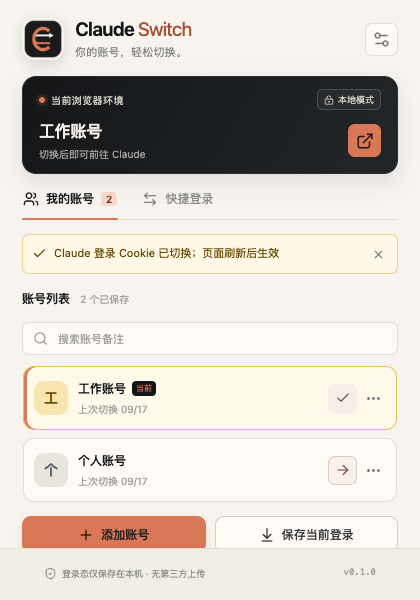

<div align="center">
  
  <h1>Claude Switch</h1>
  <p><strong>保存 · 管理 · 快速切换</strong></p>
  <p>
    <a href="https://github.com/MasterAlanLab/claude-switch/releases"></a>
    <a href="https://github.com/MasterAlanLab/claude-switch/actions/workflows/release.yml"></a>
    <a href="PRIVACY.md"></a>
  </p>
</div>

用于保存、管理和切换多个 Claude 登录状态的浏览器扩展。账号数据保存在当前浏览器本机，无需反复退出登录或重新输入账号信息。

支持 Chrome、Edge 和 Firefox，可从 [Releases](https://github.com/MasterAlanLab/claude-switch/releases) 下载对应浏览器的发布包。

> Claude Switch 并非 Anthropic 官方产品，也不隶属于或代表 Anthropic。

<p align="center">
  
</p>

## 功能特性

- 保存当前浏览器中的 Claude 登录状态。
- 管理最多 50 个本地账号记录，一键完成切换。
- 支持原始 sessionKey、`sessionKey=...`、Cookie Header 和 Cookie JSON。
- 自动识别当前登录的账号。
- 支持账号备注编辑、搜索和删除。
- 隔离普通窗口与无痕窗口的账号记录。
- 切换失败时自动恢复原有 Cookie。

## 使用方式

1. 在浏览器中正常登录 Claude。
2. 打开扩展，点击「保存当前登录」。
3. 登录其他账号并继续保存。
4. 在账号列表中选择需要使用的账号并切换。

也可以在「快捷登录」中粘贴有效的 sessionKey、Cookie JSON 或 Cookie Header。

## 安装

从 [Releases](https://github.com/MasterAlanLab/claude-switch/releases) 下载对应浏览器的发布包：

| 浏览器  | 发布包                                | 安装方式                                                                             |
| :------ | :------------------------------------ | :----------------------------------------------------------------------------------- |
| Chrome  | `claude-switch-<version>-chrome.zip`  | 解压后，在扩展管理页开启开发者模式，选择「加载已解压的扩展程序」并选择解压目录       |
| Edge    | `claude-switch-<version>-edge.zip`    | 同上，在 `edge://extensions` 开启开发人员模式后「加载解压缩的扩展」                  |
| Firefox | `claude-switch-<version>-firefox.zip` | 在 `about:debugging#/runtime/this-firefox` 选择「临时加载附加组件」并选择该 zip 文件 |

Firefox 需要 115 及以上版本。首次打开扩展时如提示授权，请点击「授权访问 claude.ai」；如需在隐私窗口中使用，请在 `about:addons` 中为 Claude Switch 开启「在隐私窗口中运行」。

`claude-switch-<version>-sources.zip` 是随 Firefox 包一同生成的源码归档，用于 AMO 审核，普通用户无需下载。

## 数据与隐私

- sessionKey、账号备注和设置保存在浏览器本地。
- 普通窗口使用 `storage.local`，无痕窗口使用 `storage.session`。
- 扩展不包含遥测、用户行为分析、远程脚本或账号数据上传接口。
- 扩展只管理 `claude.ai` 下的 `sessionKey` Cookie。
- sessionKey 以明文形式保存在扩展存储中，请在可信设备上使用。

详细说明见 [隐私政策](PRIVACY.md)。

## 权限

| 权限            | 用途                                |
| :-------------- | :---------------------------------- |
| `storage`       | 保存本地账号记录和设置              |
| `cookies`       | 读取、替换和清除 Claude 登录 Cookie |
| `activeTab`     | 识别当前标签页与窗口上下文          |
| Claude 域名权限 | 限定 Cookie 操作和站点识别范围      |

扩展不申请全站访问、剪贴板读取或网页脚本注入权限。

## 构建

项目使用 WXT、React、TypeScript 和 Bun。开发环境要求 Bun 1.3.14，Node.js 22 为兼容性基线。

```bash
git clone https://github.com/MasterAlanLab/claude-switch.git
cd claude-switch
bun install

bun run dev
bun run build
bun run release:build
```

`bun run release:build` 会在 `dist/` 中依次生成 Chrome、Edge、Firefox 发布包以及 Firefox 源码归档；也可以单独运行 `bun run zip:chrome`、`bun run zip:edge` 或 `bun run zip:firefox`。

推送 `v*` 标签后，GitHub Actions 会自动构建并把四个文件上传到对应的 Release。

## 测试

```bash
bun run typecheck
bun run test

bunx playwright install chromium
bun run test:e2e
```

端到端测试使用合成 sessionKey 和本地测试页面，不接触真实 Claude 账号。
